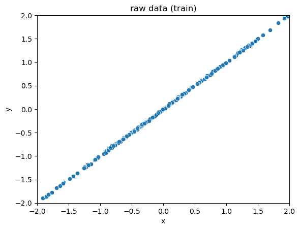
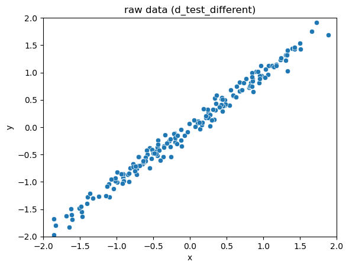

Many people who work with data are familiar with Principal Components Analysis (PCA): it's a linear transformation technique that's commonly used for dimension reduction, as well as for the orthogonalization of data prior to downstream modeling or analysis. In this article, we'll talk about another PCA-style transformation: the sphering or [whitening transformation](https://en.wikipedia.org/wiki/Whitening_transformation), and some of its data science related applications.

## PCA Projection vs Sphering Transformation

Given a set of data in R<sup>n</sup>, the goal of PCA is to find the best projection of that data into R<sup>k </sup>(where k<n): that is, the projection into R<sup>k </sup> that preserves as much of the distance information between the original points as it can. The assumption is generally that even though the data is described in n dimensions, it "really lives" in a smaller k-dimensional hyperplane, and any variation in the other n-k dimensions is just noise. 

Mathematically, you can think of a dataset X in R<sup>n</sup> (where each row of X is an n-dimensional datum) as being roughly described by a ellipsoid in R<sup>n</sup> that is formed by the matrix X<sup>T</sup>X[^1].  PCA finds the axes of this ellipsoid, sorted by their radii (longest first); rotates the ellipsoid to be axis-aligned (so that the longest axis is now the x axis); then "flattens" (projects) the data down to the hyperplane described by the first k axes.


(Caption: Conceptual illustration of PCA)

The trick, of course, is to find the right k: that is, the k dimensions that capture all the important information in the data.

A sphering transformation (to be precise, the sphering transformation called PCA whitening) also finds this hyperellipsoid of X and rotates it to be axis aligned. But instead of projecting the ellipsoid down to a lower dimensional space, sphering instead "reshapes" the ellipsoid into the unit sphere.[^2] This reshaping tends to shrink the directions the data already has a lot of variation in (the long axes of the ellipsoid), and stretch the directions where the data does not vary much (the short axes of the ellipsoid), with the result that the expected squared norm of a transformed datum is one. You can think of this stretching/shrinking of an axis x<sub>i</sub> as being proportional to 1/sqrt(s<sub>i</sub>), where s<sub>i</sub> is the ith singular value of X<sup>T</sup>X (the radius of the ith axis).[^3]  

Rather than another drawing, let's show an example. The full code for this example can be found [here](https://github.com/WinVector/TypicalityCoding/blob/main/example_sphering_transform.ipynb). 

```python
# build some example data 

def generate_ellipse(n_rows: int, mix: float = 1e-2):
	# build some example data.
	# mostly varies on the line x=y, with a small perpendicular component
	v1 = rng.normal(size=n_rows)
	v2 = rng.normal(size=n_rows)
	d = pd.DataFrame({
	'x': v1,
	'y': v1 + mix * v2,
	})
	return d

n_rows = 200
d_train = generate_ellipse(n_rows)
```




(Caption: Scatter plot of raw data. The data mostly varies along the line `x=y`, with a tiny bit of variation in the perpendicular direction -- a really skinny ellipsoid)

Our sphering transform code can be found [here](https://github.com/WinVector/TypicalityCoding/blob/main/sphering_transform.py).

```python
# Our function to fit a sphering transform. 
st = SpheringTransform()
st.fit(d_train)

# transform the training data
xformed_train = st.transform(d_train)
```


(Caption: The scatterplot of the transformed data appears more spherical)


## An Application of the Sphering Transformation

Why do we want to sphere-transform our data? One reason is that transforming the data can make it easier to detect whether a new set of data, W, has the same distribution as X. The sphering transform fixes issues of units and linearly correlated variables. It "sharpens" our statistical view on which directions of variation are common, and which are rare.

Let's call X our reference dataset. We can learn a sphering transform from X, then apply that transform to X, as we did above. Let's call the transformed data set X<sub>T</sub>. We can then get the distribution of the norms of the datums x<sub>T</sub> in X<sub>T</sub>. Let's call that distribution L<sub>X</sub>. 

```python
xformed_train_norms = norm(xformed_train, axis=1)
```


(Caption: The distribution of the norms of the transformed data)

If we transform a new data set W using the sphere-transform we learned from X, and W was drawn from the same distribution as X, then L<sub>W</sub> should be the same as L<sub>X</sub>.

```python
# data generated from the same distribution as the training data
d_test = generate_ellipse(n_rows)
xformed_test = st.transform(d_test)
xformed_test_norms = norm(xformed_test, axis=1)
```


(Caption: The norm distributions of the sphere-transformed training and test data match)

But if W was drawn from a different distribution, one that varies more in directions where X does not, then the norms of w<sub>T</sub> will tend to be longer than those of x<sub>T</sub>. And if W was drawn from a distribution that varies less in directions where X varied widely, then the norms of w<sub>T</sub> will tend to be shorter than those of x<sub>T</sub>. Either way, L<sub>W</sub> will be different from L<sub>X</sub>.

Let's see an example of this. Here we'll generate a data set that is still mostly aligned to the `x=y` axis, but has a larger perpendicular component.

```python
# the new data is still mostly aligned to x=y, 
# but has a larger perpendicular component

d_test_different = generate_ellipse(n_rows, mix=0.1)
```



(Caption: Scatterplot of the new data set)

```python
# transform the new data, and get the norm distribution
xformed_test_different = st.transform(d_test_different)
xformed_test_different_norms = norm(xformed_test_different, axis=1)
```

We can look at the distributions of the data norms in the *original* (not transformed) space. The distributions don't seem that different.


(Caption: The norm distribution of the new data set is not very different from that of the training set, in the original space)

However, the sphering transform highlights differences.


(Caption: The norm distribution of the new data set is very different from that of the training set, in the sphere-transformed space)

Even visually, the difference between the distributions L<sub>X</sub> and  L<sub>W</sub> is more striking than the difference between the distributions (scatterplots) of the datasets X and W.  In other words, we've turned the fairly hairy problem of detecting the differences of multivariate distributions (or multivariate distribution drift) into the *much* simpler problem of detecting univariate distribution drift. 

Quantitatively, there are a variety of ways to measure the difference of two univariate distributions. Common measures include the Kolmogorov-Smirnov test, Kullback-Leibler divergence, Jensen-Shannon divergence, and the Population Stability Index. You can pick the measure that is most appropriate for your specific problem.

### Digging Deeper

If you are interested in exploring sphering transformations for yourself, you can find the code that we used for this article at our [GitHub repository](https://github.com/WinVector/TypicalityCoding). The repo includes:

* [`sphering_transform.py`](https://github.com/WinVector/TypicalityCoding/blob/main/sphering_transform.py) : the module that implements the transform
* [The notebook with the examples used in this article](https://github.com/WinVector/TypicalityCoding/blob/main/example_sphering_transform.ipynb).

For fun, we've also attached some simple example applications of the sphering transform

* [The sphering transform for anomaly detection on CNC vibration data.](https://github.com/WinVector/TypicalityCoding/blob/main/test_cnc_anomaly.ipynb)
* [An example of applying the sphering transform to text embeddings: detecting changes in a text corpus.](https://github.com/WinVector/TypicalityCoding/blob/main/text_embedding_example.ipynb)

### Another PCA-based Approach to Multivariate Distribution Drift

I also want to mention another PCA-based approach to detecting differences in multivariate distributions: [reconstruction error](https://www.nannyml.com/blog/detecting-covariate-shift-multivariate-approach#detecting-covariate-shift-a-multivariate-approach). This is the approach taken by nannyML's multivariate drift detector. The article I've linked to gives a more detailed explanation, but essentially the method uses PCA to project the data down to its k-dimensional "signal" hyperplane, than projects the transformed data back into the full n dimensions. The *reconstruction error*  is the difference (or the norms of the difference vectors) between the original datums and their reconstructions.

By learning the PCA transform on a reference set, one can then compare the distribution of the reconstruction error on the reference data to the reconstruction error on new data.


## Conclusion

The sphering transform is a useful tool for the data scientist, especially when working on drift detection.

## Notes


[^1]: The analysis requires X to be centered at the origin. Our code makes sure to do this.       

[^2]: Keeping all the singular values may seem dangerous. However, at worst we are just asking the software to build bases for the column space and complementary null space.

[^3]: The above discussion assumes that X<sup>T</sup>X is full rank. If it is not, we can make it full rank by adding a tiny copy of the identity matrix to it. This regularization will fuzz the transformation a little bit, but preserves its most important properties. Again, our code makes sure to take this step.


